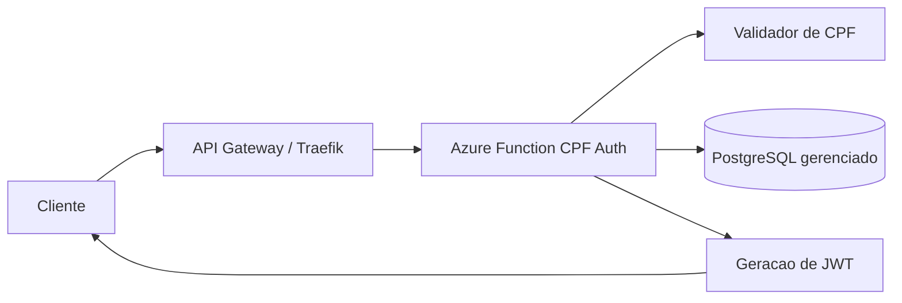

# Arquitetura Da Azure Function De CPF

## Responsabilidades

- Validar o CPF recebido.
- Consultar o cliente na base principal.
- Verificar se o cliente esta ativo.
- Emitir JWT especifico para o portal do cliente.
